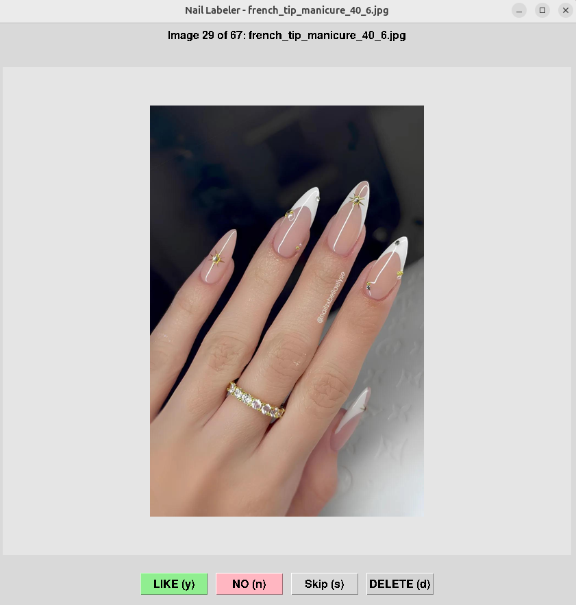
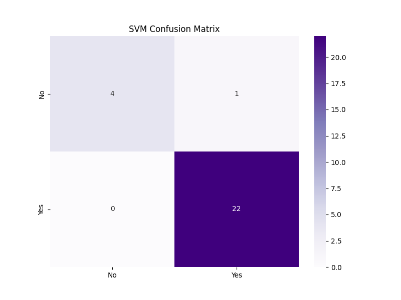
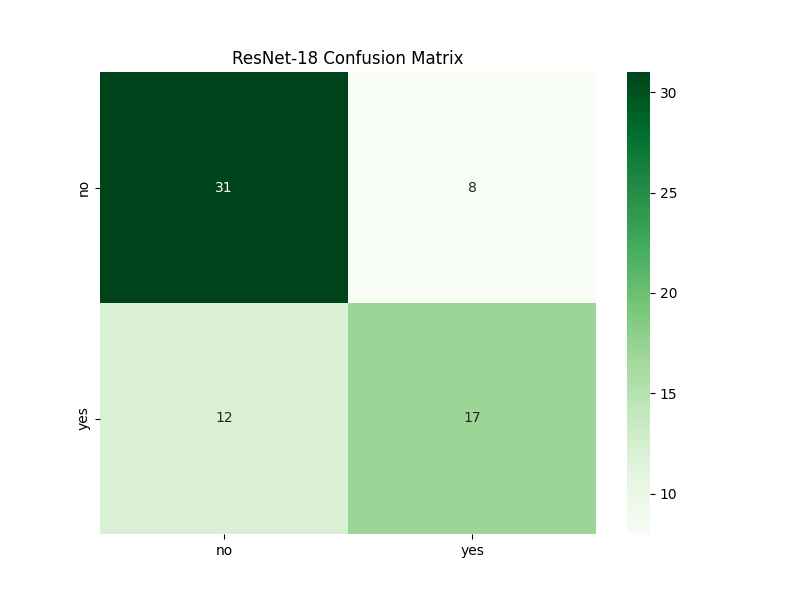
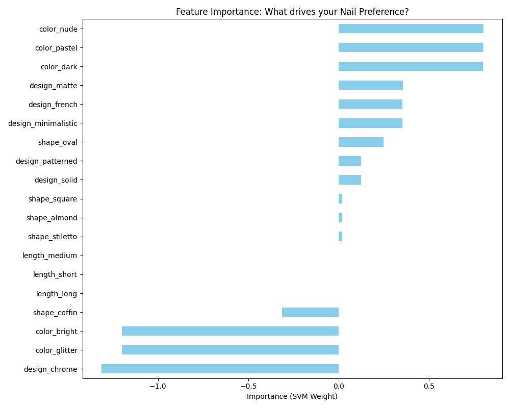

# Preference prediction for manicure with AI
**Course:** AI  
**Student Name:** Yelyzaveta Kozachenko  
**Student ID:** 111550205  
**Dataset Link:** [https://github.com/Liza228ko/Preference-prediction-for-manicure.git](https://github.com/Liza228ko/Preference-prediction-for-manicure.git)

---

## 1. Research Question and Motivation
**Motivation:**  
In this homework, I wanted to create a dataset of preferences and then I tried what is better: my own features (semantic tags) or the CNN models. In the future, this model that knows my nail preferences can be used to help me in finding the design for my next nails.

**Research Question:**  
Can machine learning models effectively distinguish personal aesthetic preferences in manicure designs by comparing high-level semantic features (Method 1) against low-level pixel data (Method 2)?

---

## 2. Documentation of Dataset
- **Data Type:** RGB Images (.jpg, .png) and categorical metadata (.csv).
- **Dataset Structure:**
  - **`nail_data.csv`**: A master CSV file containing the filenames of all images alongside their semantic tags (Length, Color, Design, Shape) and initial preference labels.
  - **`dataset/` folder**: The labeled images are organized into two subdirectories:
    - `dataset/yes/`: Images marked as "Liked".
    - `dataset/no/`: Images marked as "Disliked".
- **External Source:** Images were scraped from Bing Image Search using a custom Python crawler. Search queries included: "korean minimalist nails," "micro french manicure," "nude nail designs," and "pearl chrome nails."
- **Amount and Composition:**
  - Total Labeled Samples: 337
  - Liked (Yes): 133 images
  - Disliked (No): 204 images
- **Data Collection Process:**
  - **Scraping:** Automated collection via `downloader_v3.py`.
  - **AI-Assisted Tagging:** Every image was processed using the **OpenAI CLIP** model to generate "initial guesses" for four semantic categories.
  - **Human-in-the-Loop Labeling:** I developed a custom Tkinter-based "GUI Labeler" to manually confirm/correct the AI's guesses and provide the ground-truth "Yes/No" preference label.

<div class="sticky-section">

### GUI Labeler Tool
  
*(The custom labeling interface used to build the dataset)*

</div>

<div class="sticky-section">

- **Dataset Examples:**

| Liked Example (Yes) | Disliked Example (No) |
| :---: | :---: |
|  |  |
| *Nude, Minimalist, Oval* | *Bright, Patterned, Coffin* |

</div>

---

## 3. Description of Methods
### Method 1: Linear SVM with Semantic Features (Classical ML)
- **Feature Engineering:** Categorical tags were converted into numerical data using **One-Hot Encoding**.
- **Algorithm:** Support Vector Machine (SVM) with a **Linear Kernel** (via Scikit-Learn).
- **Rationale:** The linear kernel allows for "Feature Importance" analysis, revealing which specific descriptors drive the preference model.

### Method 2: Fine-Tuned ResNet-18 (Deep Learning)
- **Algorithm:** ResNet-18 (via PyTorch).
- **Transfer Learning:** Used weights pre-trained on ImageNet and **unfroze the final residual block (layer4)** of the ResNet.

---

<div class="sticky-section">

## 4. Description of Experiments and Results
### 4.1. Comparative Performance
| Metric | Method 1: SVM (Semantic) | Method 2: ResNet-18 (Pixels) |
| :--- | :---: | :---: |
| **5-Fold CV Accuracy** | **85.93%** | N/A |
| **Test Accuracy** | **96.30%** | **71.00%** |
| **AUROC** | **0.8864** | **0.7820** |
| **Precision (Liked)** | 0.96 | 0.68 |
| **Recall (Liked)** | 1.00 | 0.59 |
| **F1-Score (Liked)** | 0.98 | 0.63 |

</div>

**Analysis:**  
The SVM achieved a near-perfect score, demonstrating that subjective taste is highly correlated with semantic descriptors. The ResNet-18 performed respectably (71%), significantly outperforming a baseline MobileNetV2 (57%) thanks to the fine-tuning of `layer4`.

### 4.2. Visual Analysis of Results

<div class="sticky-section">

#### SVM Confusion Matrix (Semantic Features)
{width=80%}

</div>

<div class="sticky-section">

#### ResNet-18 Confusion Matrix (Raw Pixels)
{width=80%}

</div>

<div class="sticky-section">

#### Feature Importance: What drives your Nail Preference?
{width=100%}

</div>

<div class="sticky-section">

### 4.3. Impact of Training Data Size
- **Analysis Method:** I evaluated how the SVM's accuracy changes as the amount of training data increases.
- **20% Data:** 66.67% accuracy.
- **60% Data:** 87.50% accuracy.
- **100% Data:** 96.30% accuracy.
- **Conclusion:** The model shows a strong "learning curve," suggesting that even a small increase in labeled data (from 200 to 300) significantly stabilized the aesthetic prediction.

</div>

### 4.4. Dimensionality Reduction (PCA)
- **Analysis Method:** I applied PCA to the one-hot encoded semantic features to reduce the feature space.
- **Full Features (Baseline):** 96.30% accuracy.
- **PCA (Reduced to 5 components):** 92.59% accuracy.
- **Conclusion:** Reducing dimensionality slightly decreased accuracy, indicating that specific, rare tags (like 'coffin' shape or 'matte' design) carry unique information that PCA compresses away.

---

## 5. Discussion
- **Expectations vs. Reality:** The results were mostly what I expected. I suspected that the SVM would be much better because it uses the same "rules" I use to pick my nails (like color and shape). The ResNet-18 did okay, but it proved that learning my personal style from just pixels is much harder for an AI than following simple text tags.
- **Key Factors:** The main thing affecting the results was the small size of the dataset. While 300 images is enough for an SVM, it is barely enough for a deep learning model to "see" what makes a design pretty. The class imbalance (having more "No" than "Yes" examples) also made the CNN a bit biased toward rejecting designs at first.
- **Future Experiments:** If I had more time, I would try to build a "multi-modal" model that looks at both the image and the tags at the same time. I would also try to collect more images of designs I like to balance the dataset better. Ultimately, I would love to turn this into a recommendation tool that could show me pictures of new nail designs I might like for my next manicure based on these learned preferences.
- **Lessons Learned:** I learned that building a good dataset is more than half the work. Using CLIP to "translate" images into features felt like a cheat code that made the classification task much simpler. It showed me that often the quality of your features is more important than how complex your model is.
- **Remaining Questions:** I am still wondering if a model could ever truly learn my "style" without being told what a color or shape is first. Is there a point where a computer, given enough data, would just "understand" my taste on its own?

---

## 6. List of References
1. **Scikit-learn Documentation:** API Reference for Linear Support Vector Classification (LinearSVC).  
   URL: https://scikit-learn.org/stable/modules/generated/sklearn.svm.LinearSVC.html
2. **PyTorch Documentation:** Official Specification for ResNet-18 and Transfer Learning.  
   URL: https://pytorch.org/vision/stable/models/resnet.html
3. **OpenAI CLIP Research:** CLIP (Contrastive Language-Image Pre-training) Model Card and Documentation.  
   URL: https://github.com/openai/CLIP
4. **Pandas Documentation:** One-Hot Encoding and Categorical Data Preprocessing (get_dummies).  
   URL: https://pandas.pydata.org/docs/reference/api/pandas.get_dummies.html
5. **Matplotlib/Seaborn:** Visualization Specifications for Confusion Matrices and Feature Importance.  
   URL: https://seaborn.pydata.org/generated/seaborn.heatmap.html

---

## Appendix: Program Code

### FILE: train_final_svm.py
```python
import pandas as pd
import numpy as np
from sklearn.svm import SVC
from sklearn.model_selection import train_test_split, cross_val_score
from sklearn.metrics import classification_report, confusion_matrix, accuracy_score
from sklearn.preprocessing import LabelEncoder
import matplotlib.pyplot as plt
import seaborn as sns
import os

def load_and_preprocess():
    # Load all labeled data from the dataset folders
    all_rows = []
    categories = ['yes', 'no']
    
    # Load the features from our AI-tagged master list
    if not os.path.exists('nail_data.csv'):
        print("Error: nail_data.csv not found!")
        return None, None
        
    master_df = pd.read_csv('nail_data.csv')
    
    for cat in categories:
        cat_dir = os.path.join('dataset', cat)
        if not os.path.exists(cat_dir): continue
        
        for fname in os.listdir(cat_dir):
            row = master_df[master_df['filename'] == fname]
            if not row.empty:
                r_dict = row.iloc[0].to_dict()
                r_dict['liked'] = cat
                all_rows.append(r_dict)

    df = pd.DataFrame(all_rows)
    print(f"Total labeled samples for training: {len(df)}")
    
    # Encode categorical features into numbers (One-Hot Encoding for better SVM interpretation)
    feature_cols = ['length', 'color', 'design', 'shape']
    df_encoded = pd.get_dummies(df[feature_cols])
    
    df_encoded['liked'] = df['liked'].map({'yes': 1, 'no': 0})
    
    return df_encoded, df_encoded.columns.drop('liked')

if __name__ == "__main__":
    df, feature_names = load_and_preprocess()
    
    X = df[feature_names]
    y = df['liked']
    
    # Split
    X_train, X_test, y_train, y_test = train_test_split(X, y, test_size=0.2, random_state=42)
    
    # Train SVM with Linear kernel to extract feature importance (weights)
    print("\nTraining Linear SVM for Feature Analysis...")
    model = SVC(kernel='linear', probability=True)
    
    # 5-Fold Cross Validation (Requirement)
    cv_scores = cross_val_score(model, X, y, cv=5)
    print(f"5-Fold CV Accuracy: {cv_scores.mean():.4f}")
    
    model.fit(X_train, y_train)
    
    # Evaluation
    y_pred = model.predict(X_test)
    print("\nFinal Test Results:")
    print(f"Accuracy: {accuracy_score(y_test, y_pred):.4f}")
    print(classification_report(y_test, y_pred))
    
    # FEATURE IMPORTANCE ANALYSIS
    # Get weights from the linear SVM
    weights = model.coef_[0]
    feat_importances = pd.Series(weights, index=feature_names)
    
    plt.figure(figsize=(10, 8))
    feat_importances.sort_values().plot(kind='barh', color='skyblue')
    plt.title('Feature Importance: What drives your Nail Preference?')
    plt.xlabel('Importance (SVM Weight)')
    plt.tight_layout()
    plt.savefig('nail_preference_importance.png')
    
    # Confusion Matrix
    cm = confusion_matrix(y_test, y_pred)
    plt.figure(figsize=(8,6))
    sns.heatmap(cm, annot=True, fmt='d', cmap='Purples', xticklabels=['No', 'Yes'], yticklabels=['No', 'Yes'])
    plt.title('SVM Confusion Matrix')
    plt.savefig('final_svm_cm.png')
    
    print("\nAnalysis Complete!")
    print("- Confusion matrix saved to 'final_svm_cm.png'")
    print("- Feature importance saved to 'nail_preference_importance.png'")
```

### FILE: train_resnet.py
```python
import os
import sys

# Add external libs to path
sys.path.append('/media/liza/B779-017B/ai/python_libs')

import torch
import torch.nn as nn
import torch.optim as optim
from torchvision import datasets, models, transforms
from torch.utils.data import DataLoader, random_split, Subset
import matplotlib.pyplot as plt
from sklearn.metrics import classification_report, confusion_matrix
import seaborn as sns
import numpy as np

def train_resnet(data_dir, num_epochs=12, batch_size=16):
    device = torch.device("cuda" if torch.cuda.is_available() else "cpu")
    print(f"Using device: {device}")

    # 1. Transforms (same as before for a fair comparison)
    data_transforms = transforms.Compose([
        transforms.Resize((224, 224)),
        transforms.RandomHorizontalFlip(),
        transforms.RandomRotation(20),
        transforms.ToTensor(),
        transforms.Normalize([0.485, 0.456, 0.406], [0.229, 0.224, 0.225])
    ])

    # 2. Load Dataset
    full_dataset = datasets.ImageFolder(data_dir, transform=data_transforms)
    
    wanted_classes = ['no', 'yes']
    
    indices = [i for i, (_, label) in enumerate(full_dataset.samples) 
               if full_dataset.classes[label] in wanted_classes]
    
    orig_to_new = {full_dataset.class_to_idx[cls]: i for i, cls in enumerate(wanted_classes)}
    
    class FilteredDataset(torch.utils.data.Dataset):
        def __init__(self, subset, transform=None):
            self.subset = subset
            self.transform = transform
            
        def __getitem__(self, index):
            x, y = self.subset[index]
            if self.transform:
                x = self.transform(x)
            return x, orig_to_new[y]
            
        def __len__(self):
            return len(self.subset)

    base_subset = Subset(datasets.ImageFolder(data_dir), indices)
    
    train_size = int(0.8 * len(base_subset))
    val_size = len(base_subset) - train_size
    # Set a seed so we get the same split as the MobileNetV2 experiment if it used seed 42 (it didn't, but good practice)
    train_indices, val_indices = random_split(range(len(base_subset)), [train_size, val_size], generator=torch.Generator().manual_seed(42))
    
    train_dataset = FilteredDataset(Subset(base_subset, train_indices), transform=data_transforms)
    val_dataset = FilteredDataset(Subset(base_subset, val_indices), transform=data_transforms)

    train_loader = DataLoader(train_dataset, batch_size=batch_size, shuffle=True)
    val_loader = DataLoader(val_dataset, batch_size=batch_size, shuffle=False)

    print(f"Dataset: {len(base_subset)} images ({train_size} train, {val_size} val)")

    # 3. Model: ResNet-18
    print("Initializing ResNet-18...")
    model = models.resnet18(weights=models.ResNet18_Weights.IMAGENET1K_V1)
    
    # Freeze earlier layers
    for param in model.parameters():
        param.requires_grad = False
        
    # Unfreeze the final residual block (layer4) to allow the model to learn more complex nail features
    for param in model.layer4.parameters():
        param.requires_grad = True

    # Replace the final fully connected layer
    num_ftrs = model.fc.in_features
    model.fc = nn.Linear(num_ftrs, 2)
    model = model.to(device)

    criterion = nn.CrossEntropyLoss()
    # Using SGD with momentum often works better for fine-tuning ResNets than Adam
    optimizer = optim.SGD(filter(lambda p: p.requires_grad, model.parameters()), lr=0.001, momentum=0.9)

    # 4. Training
    print("\nTraining ResNet-18...")
    for epoch in range(num_epochs):
        model.train()
        running_loss = 0.0
        for inputs, labels in train_loader:
            inputs, labels = inputs.to(device), labels.to(device)
            optimizer.zero_grad()
            outputs = model(inputs)
            loss = criterion(outputs, labels)
            loss.backward()
            optimizer.step()
            running_loss += loss.item() * inputs.size(0)
            
        print(f"Epoch {epoch+1}/{num_epochs} - Loss: {running_loss/train_size:.4f}")

    # 5. Evaluation
    model.eval()
    all_preds, all_labels = [], []
    with torch.no_grad():
        for inputs, labels in val_loader:
            outputs = model(inputs.to(device))
            _, preds = torch.max(outputs, 1)
            all_preds.extend(preds.cpu().numpy())
            all_labels.extend(labels.numpy())

    print("\nResNet-18 Evaluation Results:")
    print(classification_report(all_labels, all_preds, target_names=wanted_classes))
    
    cm = confusion_matrix(all_labels, all_preds)
    plt.figure(figsize=(8,6))
    sns.heatmap(cm, annot=True, fmt='d', cmap='Greens', xticklabels=wanted_classes, yticklabels=wanted_classes)
    plt.title('ResNet-18 Confusion Matrix')
    plt.savefig('resnet_confusion_matrix.png')
    print("Done! saved to 'resnet_confusion_matrix.png'")

if __name__ == "__main__":
    train_resnet('dataset', num_epochs=12)
```

### FILE: ai_tagger.py
```python
import os
import sys

# Add external libs to path
sys.path.append('/media/liza/B779-017B/ai/python_libs')

import torch
from PIL import Image
from transformers import CLIPProcessor, CLIPModel
import csv
from tqdm import tqdm

def ai_tag_all(raw_dir, output_csv):
    print("Loading CLIP AI Model...")
    model_name = "openai/clip-vit-base-patch32"
    model = CLIPModel.from_pretrained(model_name)
    processor = CLIPProcessor.from_pretrained(model_name)
    
    device = "cuda" if torch.cuda.is_available() else "cpu"
    model.to(device)

    # Define our semantic search categories
    categories = {
        'length': ["short nails", "medium length nails", "long nails"],
        'color': ["nude nails", "dark nails", "bright nails", "pastel nails", "glitter nails"],
        'design': ["solid color nails", "french tip nails", "minimalistic nail art", "patterned nail art", "chrome nails", "matte nails"],
        'shape': ["oval nails", "square nails", "almond nails", "coffin nails", "stiletto nails"]
    }

    images = [f for f in os.listdir(raw_dir) if f.lower().endswith(('.png', '.jpg', '.jpeg'))]
    
    results = []
    
    for img_name in tqdm(images, desc="AI Tagging"):
        try:
            img_path = os.path.join(raw_dir, img_name)
            image = Image.open(img_path).convert("RGB")
            
            tags = {'filename': img_name, 'liked': 'yes'}
            
            for cat_name, prompts in categories.items():
                inputs = processor(text=prompts, images=image, return_tensors="pt", padding=True).to(device)
                outputs = model(**inputs)
                logits_per_image = outputs.logits_per_image
                probs = logits_per_image.softmax(dim=1)
                
                best_idx = probs.argmax().item()
                # Clean up the prompt to just the label (e.g., "short nails" -> "short")
                tag = prompts[best_idx].replace(" nails", "").replace(" nail art", "").replace(" color", "").replace(" length", "").replace(" tip", "")
                tags[cat_name] = tag
            
            results.append(tags)
        except Exception as e:
            print(f"Error processing {img_name}: {e}")

    with open(output_csv, 'w', newline='') as f:
        writer = csv.DictWriter(f, fieldnames=['filename', 'liked', 'length', 'color', 'design', 'shape'])
        writer.writeheader()
        writer.writerows(results)
    
    print(f"\nAI Tagging complete! Data saved to {output_csv}")

if __name__ == "__main__":
    ai_tag_all('raw_images', 'nail_data.csv')
```

### FILE: run_extra_experiments.py
```python
import pandas as pd
import numpy as np
from sklearn.svm import SVC
from sklearn.decomposition import PCA
from sklearn.model_selection import train_test_split
from sklearn.metrics import accuracy_score
import os

def load_data():
    all_rows = []
    categories = ['yes', 'no']
    master_df = pd.read_csv('nail_data.csv')
    for cat in categories:
        cat_dir = os.path.join('dataset', cat)
        if not os.path.exists(cat_dir): continue
        for fname in os.listdir(cat_dir):
            row = master_df[master_df['filename'] == fname]
            if not row.empty:
                r_dict = row.iloc[0].to_dict()
                r_dict['liked'] = 1 if cat == 'yes' else 0
                all_rows.append(r_dict)
    df = pd.DataFrame(all_rows)
    feature_cols = ['length', 'color', 'design', 'shape']
    X = pd.get_dummies(df[feature_cols])
    y = df['liked']
    return X, y

def run_pca_experiment():
    X, y = load_data()
    X_train, X_test, y_train, y_test = train_test_split(X, y, test_size=0.2, random_state=42)
    
    # Baseline (No PCA)
    model = SVC(kernel='linear')
    model.fit(X_train, y_train)
    base_acc = accuracy_score(y_test, model.predict(X_test))
    
    # With PCA (Reduce to 5 components)
    pca = PCA(n_components=5)
    X_pca = pca.fit_transform(X)
    X_p_train, X_p_test, y_p_train, y_p_test = train_test_split(X_pca, y, test_size=0.2, random_state=42)
    model_pca = SVC(kernel='linear')
    model_pca.fit(X_p_train, y_p_train)
    pca_acc = accuracy_score(y_p_test, model_pca.predict(X_p_test))
    
    print(f"PCA EXPERIMENT:")
    print(f"Baseline (Full Features): {base_acc:.4f}")
    print(f"With PCA (5 components): {pca_acc:.4f}")

def run_data_size_experiment():
    X, y = load_data()
    sizes = [0.2, 0.4, 0.6, 0.8, 1.0]
    print("\nDATA SIZE EXPERIMENT (SVM):")
    for size in sizes:
        if size < 1.0:
            X_sub, _, y_sub, _ = train_test_split(X, y, train_size=size, random_state=42)
        else:
            X_sub, y_sub = X, y
            
        X_train, X_test, y_train, y_test = train_test_split(X_sub, y_sub, test_size=0.2, random_state=42)
        model = SVC(kernel='linear')
        model.fit(X_train, y_train)
        acc = accuracy_score(y_test, model.predict(X_test))
        print(f"Training Size {int(size*100)}%: Accuracy {acc:.4f}")

if __name__ == "__main__":
    run_pca_experiment()
    run_data_size_experiment()
```
